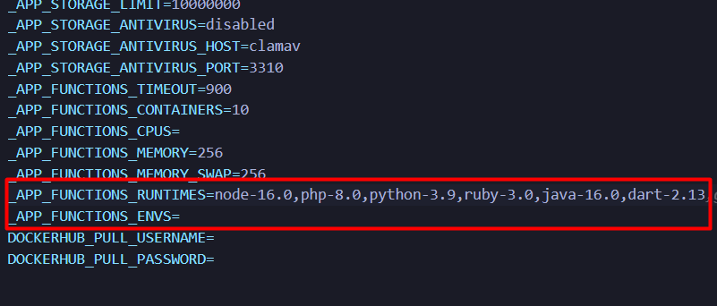

<center>

# TroubleShoot Guide ⚒️

</center>

## Add Dart Runtime to your Appwrite Console

* Go to your appwrite directory

If you are using WSL it should be located in `\home\username\appwrite\`

* Open up the `.env` file

* Keep the `_APP_FUNCTIONS_ENVS` empty and add the `dart-2.13` alongside the existing ones in the `_APP_FUNCTIONS_RUNTIMES`



* Save the file

* Then run the following command in the WSL terminal

```bash
docker compose up -d
```

This command will restart all the existing appwrite containers along with the latest changes. Now hopover to appwrite console and you can see the `Dart` Runtime option in the functions.