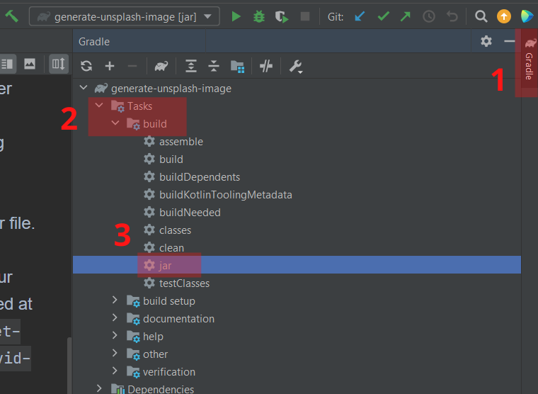
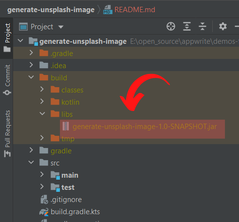

# 📷 Generate image using Unsplash API
A sample Kotlin Cloud Function to get an image from [Unsplash API](https://unsplash.com/documentation#search-photos)

## 📝 Environment Variables
When running function, pass country code or name as function data.

* **APPWRITE_FUNCTION_DATA** - Keyword you want to search for. Should not be empty
* **UNSPLASH_ACCESS_KEY** - Your Unsplash Access Key for public authorization

## 🚀 Building and Packaging

To package this example as a cloud function, follow these steps.

* Import the project into IntelliJ, or any other IDE that has support for Kotlin projects.

* Build a jar for the project. If you are using Intellij, follow these steps:
    - Open gradle tab, goto `Tasks/build/jar` and create a jar file.

      
    - If you followed the steps correctly, our output jar file would mostly be created at `demos-for-functions/kotlin/generate-unsplash-image/build/libs/generate-unsplash-image-1.0-SNAPSHOT.jar`

      

* Create a tarfile

```bash
$ cd demos-for-functions/kotlin/generate-unsplash-image/build/libs/
$ tar -zcvf code.tar.gz .\generate-unsplash-image-1.0-SNAPSHOT.jar
```

* Navigate to the Overview Tab of your Cloud Function > Deploy Tag
* Input the command that will run your function (in this case `java -jar generate-unsplash-image-1.0-SNAPSHOT.jar`) as your entry point command
* Upload your `tarfile`
* Click 'Activate'

## 🎯 Trigger
Can be triggered from manually from the Appwrite Console.