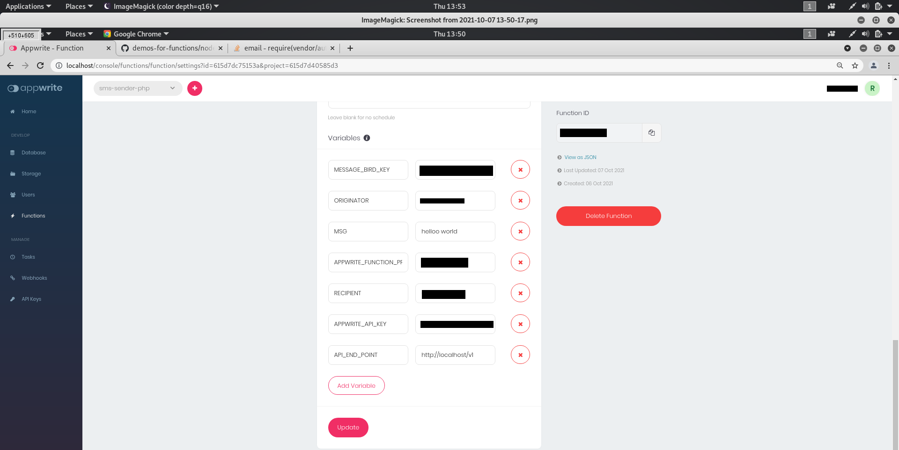
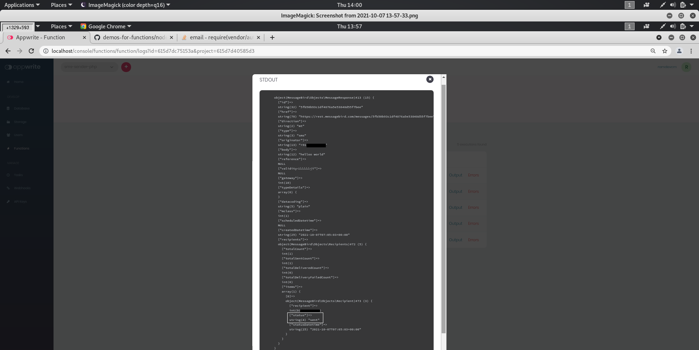

# 📧 Sending SMS using Message Bird API
A sample php Cloud Function for sending an SMS using message-bird api.

## 📝 Environment Variables
Go to Settings tab of your Cloud Function. Add the following environment variables.

* **MESSAGE_BIRD_KEY** - Live API Key from Message Bird  
* **ORIGINATOR** - Sender phone number
* **MSG** - Message that is to be sent
* **APPWRITE_FUNCTION_PROJECT_ID** - Appwrite project ID
* **RECIPIENT** - Receiver phone number
* **APPWRITE_API_KEY** - Appwrite API SecretKey
* **API_END_POINT** - Appwrite EndPoint Eg:- 
http://localhost/v1

<div class="center">
    
</div>

## 🚀 Building and Packaging

To package this example as a cloud function, follow these steps.

```bash
$ cd demos-for-functions/php/send-message-bird-sms/

$ composer require message/php-rest-api
$ composer require appwrite/appwrite

```

* Ensure that your folder structure looks like this 
```
.
├── vendor/
├── composer.json
├── composer.lock
└── index.php
```

* Create a tarfile

```bash
$ cd ..
$ tar -zcvf code.tar.gz send-message-bird-sms
```

* Navigate to the Overview Tab of your Cloud Function > Deploy Tag
* Input the command that will run your function (in this case "php index.php") as your entrypoint command
* Upload your tarfile 
* Click 'Activate'

## 🎯 Trigger

Output log will be obtained

<div class="center">
    
</div>

