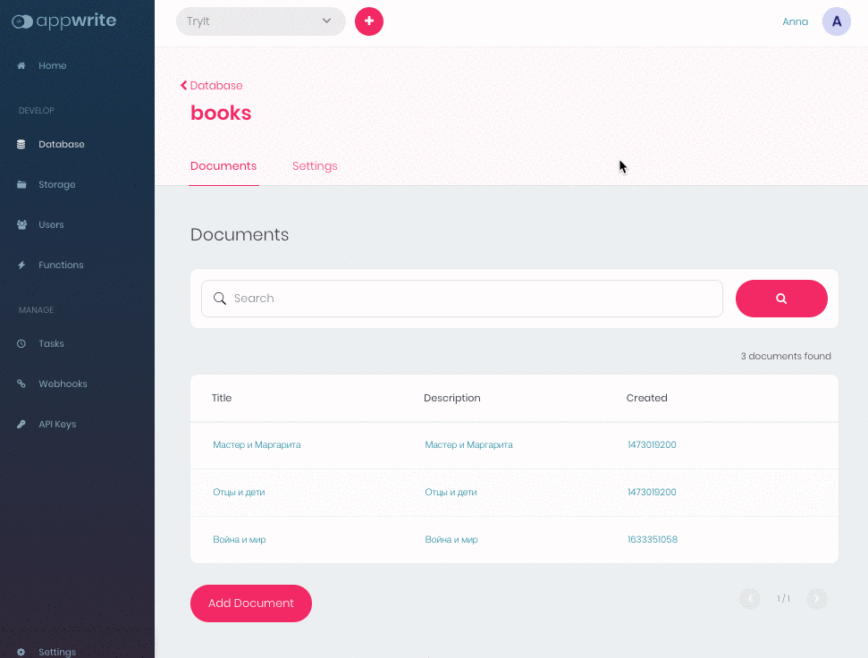

# 📧  Prune documents
This function scans all documents in all collections to read their createdAt attribute. If a document has this attribute and it's older than 5 years, it removes the document. Function outputs count of deleted documents.

## 📝 Environment Variables
Go to Settings tab of your Cloud Function. Add the following environment variables.

Required:
* **APPWRITE_API_ENDPOINT** — Your Appwrite Endpoint
* **APPWRITE_SECRET_KEY** — Your Appwrite API key with `collections.read`, `documents.read` and `documents.write` permissions

## 🚀 Building and Packaging
To package this example as a cloud function, follow these steps.

```bash
$ cd demos-for-functions/ruby/prune-documents
$ docker run --rm -v $(pwd):/app -w /app --env GEM_HOME=./.appwrite appwrite/env-ruby-3.0:1.0.0 bundle install
```
* Ensure that your folder structure looks like this
```
.
├── .appwrite/
├── Gemfile
├── Gemfile.lock
├── main.rb
└── README.md
```

* Create a tarfile

```bash
$ tar -zcvf ../prune_documents.tar.gz .
```

* Navigate to the Overview Tab of your Cloud Function > Deploy Tag
* Input the command that will run your function (in this case `ruby main.rb`) as your entrypoint command
* Upload your tarfile
* Click 'Activate'

## Usage
* Manually:
  * Go to the Function **Overview** Tab
  * Click **Execute Now**
* Add function execution to schedule:
  * Go to the Function **Settings** Tab
  * Fill CRON schedule, for example `0 6 * * *` — will execute function every day at 6am

Function outputs amount of deleted documents.


